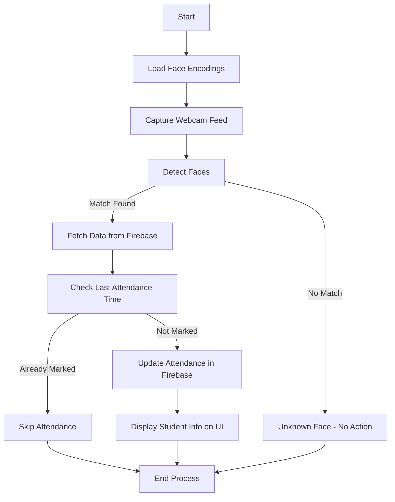

# Face Recognition with Real-Time Database

## Introduction
This project is a **real-time Face Attendance System** that uses **face recognition** and a **Firebase real-time database** to track attendance efficiently. The system captures live video, detects faces, and marks attendance automatically in the database.

---

## Features
✅ **Real-time face detection** using OpenCV  
✅ **Face recognition** using pre-stored encodings  
✅ **Live database integration** with Firebase  
✅ **Graphical user interface** for better interaction  
✅ **Automatic attendance marking** with duplicate prevention  
✅ **Image storage in Firebase Storage**  

---

## Technology Stack
- **Python**
- **OpenCV (cv2)** – Video processing
- **face_recognition** – Face detection and encoding
- **Firebase** – Real-time database & storage
- **cvzone** – UI enhancements
- **pickle** – Data serialization
- **NumPy** – Data handling

---

## Project Workflow
1. **Setup Firebase** and add credentials (`serviceAccountKey.json`)
2. **Run `AddDatatoDatabase.py`** to add student data to Firebase
3. **Run `EncodeGenerator.py`** to generate face encodings
4. **Run `Main.py`** to start the real-time face recognition system
5. **System detects and identifies faces**
6. **Attendance is updated in Firebase**

---

## File Structure
```
Face-Attendance-System/
│-- Resources/
│   │-- background.png  # UI background
│   │-- Modes/  # Mode images
│-- Images/  # Student images for encoding
│-- EncodeFile.p  # Encoded face data
│-- serviceAccountKey.json  # Firebase credentials
│-- Main.py  # Main execution file
│-- EncodeGenerator.py  # Generates face encodings
│-- AddDatatoDatabase.py  # Adds student records to Firebase
│-- README.md  # Project documentation
```

---

## Installation & Setup
### 1️⃣ Clone the Repository
```bash
git clone https://github.com/yourusername/Face-Recognition-Attendance.git
cd Face-Recognition-Attendance
```

### 2️⃣ Install Dependencies
```bash
pip install opencv-python numpy face-recognition firebase-admin cvzone
```

### 3️⃣ Setup Firebase
- Create a Firebase project at [Firebase Console](https://console.firebase.google.com/)
- Enable **Realtime Database** and **Storage**
- Download the `serviceAccountKey.json` file and place it in the project directory

### 4️⃣ Run the Scripts
#### **Step 1: Add Student Data to Firebase**
```bash
python AddDatatoDatabase.py
```

#### **Step 2: Generate Face Encodings**
```bash
python EncodeGenerator.py
```

#### **Step 3: Start Face Recognition System**
```bash
python Main.py
```

---

## System Flowchart


---

## Future Enhancements
🔹 **Multi-camera support** for better scalability  
🔹 **Mobile app integration** for easier attendance tracking  
🔹 **Cloud-based AI models** for more accurate face recognition  

---

## License
This project is open-source and available under the MIT License.

---

## Contributors
👤 Your Name - **[GitHub Profile](https://github.com/yourusername)**  

---

## Acknowledgments
Special thanks to **OpenCV, Firebase, and Face Recognition** communities for making this project possible!

